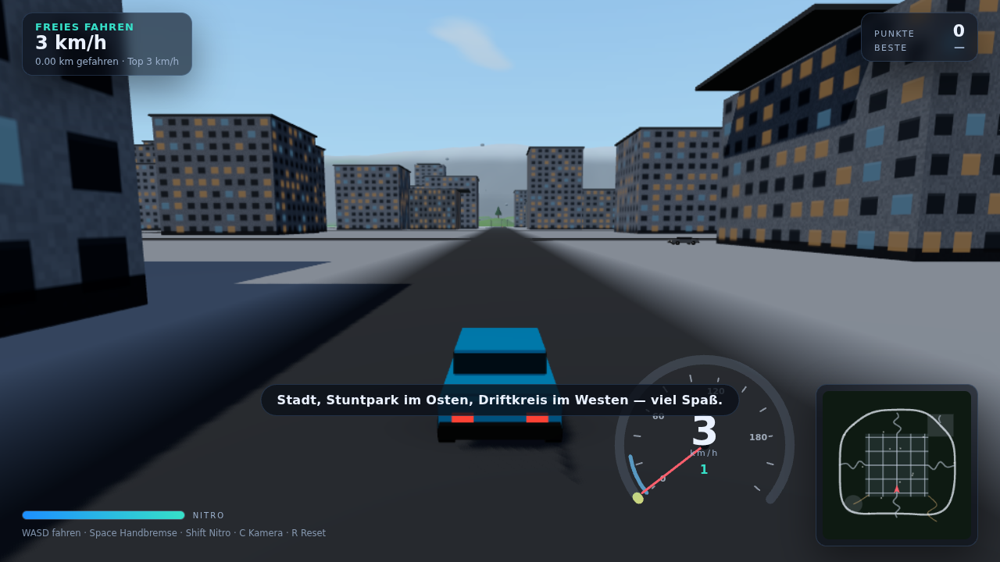
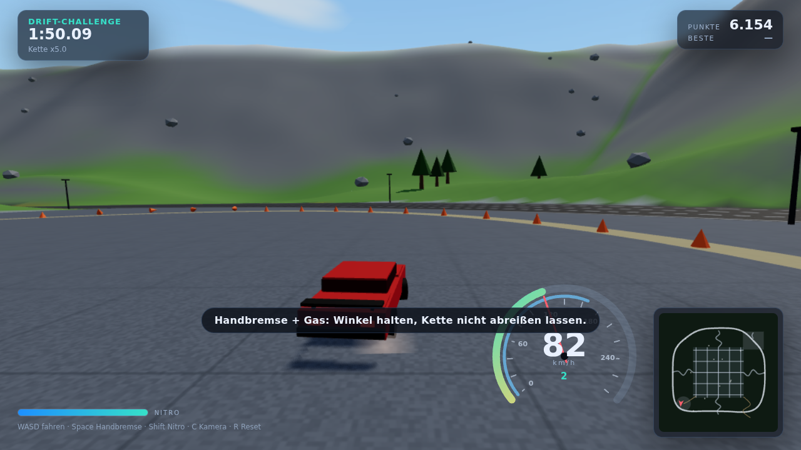
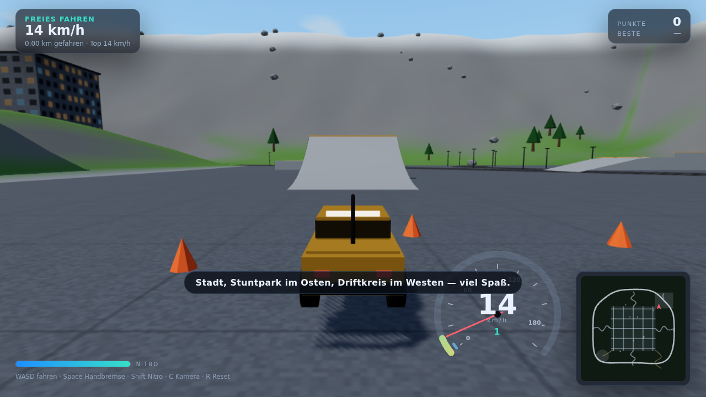

# Asphalt Drift

Ein Open-World-Fahrspiel für den Browser: freies Fahren durch eine Stadt mit
Umland, Drift-Challenge auf dem Driftkreis und Zeitfahren über 12 Checkpoints.
Kein Download, kein Build-Schritt, keine Engine — reines WebGL mit eigener
Arcade-Fahrphysik. Als Vorbild diente die Art von Spiel, die auf drivegame.io
läuft (freies Fahren, Drift, Stunts, Physik-Handling); Code, Welt und alle
Assets in diesem Repo sind eigenständig entstanden.



## Starten

```bash
npm start           # startet einen lokalen Server und öffnet den Browser
# oder ohne npm:
python3 -m http.server 8080     # danach http://localhost:8080 öffnen
```

Ein Modulserver ist nötig, weil das Spiel ES-Module lädt — `index.html` direkt
per Doppelklick (`file://`) funktioniert nicht.

## Steuerung

| Taste | Funktion |
| --- | --- |
| `W` `A` `S` `D` / Pfeile | Gas, Lenken, Bremse/Rückwärts |
| `Space` | Handbremse (der Drift-Knopf) |
| `Shift` | Nitro (füllt sich von selbst wieder auf) |
| `C` | Kamera: Verfolger, Nah, Cockpit, Kino, Vogelperspektive |
| `T` | Tageszeit: Tag → Abend → Nacht (nachts mit Scheinwerfern) |
| `R` | Reset auf die nächste Straße |
| `Esc` / `P` | Pause · `M` Ton · `F` Vollbild · `H` Hilfe |

Gamepad (Standard-Mapping) und Touch-Buttons auf dem Handy funktionieren
ebenfalls.

## Modi

* **Freies Fahren** — 1,6 × 1,6 km Welt: Rasterstadt, Ringautobahn, Zubringer,
  Schotterwege ins Hügelland, Stuntpark im Osten, Driftkreis im Westen.
  Drift- und Airtime-Punkte laufen mit, Ziele gibt es keine.
* **Drift-Challenge** — 120 Sekunden auf dem Driftkreis. Punkte steigen mit
  Winkel und Geschwindigkeit, die Kette wächst bis Faktor 5 und reißt ab,
  sobald das Auto wieder geradeaus rollt.
* **Zeitfahren** — 12 Tore quer durch Stadt und Ring. Bestzeit wird pro
  Fahrzeug im Browser (localStorage) gespeichert.



## Fahrzeuge

Werte gemessen aus dem laufenden Spiel (Vollgas auf Asphalt, ohne Nitro):

| Fahrzeug | Klasse | Antrieb | 0–100 km/h | erreichte V-max |
| --- | --- | --- | --- | --- |
| Sprint 1.6 | Kompakt | Front | 5,7 s | ~176 km/h |
| Brute V8 | Muscle | Heck | 3,6 s | ~225 km/h |
| Trail 4x4 | Offroad | Allrad | 6,6 s | ~160 km/h |
| Apex GT | Supersport | Allrad | 2,5 s | ~270 km/h |

Heckantrieb bricht früher aus, der 4x4 hat auf Wiese und Schotter deutlich mehr
Grip als die Straßenautos.

## Wie die Fahrphysik funktioniert

`src/vehicle.js` rechnet ein Fahrradmodell mit Schräglaufwinkeln:

* Längsdynamik: Leistungskurve (fällt zum Top-Speed hin auf null), Luft- und
  Rollwiderstand werden so aufgeteilt, dass die Endgeschwindigkeit exakt dem
  Fahrzeugwert entspricht; weicher Untergrund erhöht den Rollwiderstand.
* Querdynamik: Schräglaufwinkel vorne/hinten → Seitenkräfte, begrenzt durch
  einen **Reibkreis**. Hartes Gas oder Bremsen frisst also Seitenhaftung —
  daraus entstehen Übersteuern und Drifts von selbst. Die Handbremse senkt nur
  das Grip-Limit der Hinterachse.
* Untergrund: vier Räder tasten das Höhenfeld ab. Daraus kommen Nick- und
  Wankwinkel, Federweg und der Absprung an Rampenkanten (die vertikale
  Geschwindigkeit stammt aus der Steigrate der Rampe, deshalb fliegt das Auto
  realistisch weit).
* Kollisionen: Kreis gegen Box/Zylinder mit Rückstoß und Schrammdämpfung;
  Hütchen werden als eigene kleine Physikobjekte weggekickt.

## Aufbau

```
index.html          HUD- und Menü-Markup, Importmap
styles.css          komplettes UI
src/main.js         Spielzustand, Modi, Renderloop, Menüs
src/world.js        Weltgenerierung: Terrain, Straßen, Stadt, Rampen, Kollider
src/vehicle.js      Fahrphysik + Fahrzeugbau (Geometrie aus Code)
src/camera.js       fünf Kameramodi, Federung, Screenshake
src/effects.js      Reifenspuren, Staub, Funken (feste Buffer-Pools)
src/sky.js          Himmel, Licht, Nebel, Wolken, Sterne, Tageszeit
src/audio.js        Motor, Reifen, Wind, Aufpralle — komplett synthetisiert
src/traffic.js      KI-Verkehr auf Ring und Stadtrunden
src/hud.js          Tacho, Minimap, Anzeigen
src/textures.js     alle Texturen zur Laufzeit auf Canvas gemalt
src/util.js         Mathe, Rauschen, seedbarer Zufall
tools/smoke-test.mjs  Headless-Test im echten Browser
vendor/three/       three.js r186 (MIT), lokal eingebunden
```

Die Welt ist deterministisch aus einem Seed erzeugt (`createWorld(scene, { seed })`).
Terrain, Grip und Oberflächenart liegen als Gitterfelder vor, die Physik fragt
genau die Geometrie ab, die auch gerendert wird. Es gibt keine Bilddateien und
keine Audiodateien: Fassaden, Asphalt, Wolken und Motorsound entstehen im Code.



## Tests

```bash
npm test            # startet Chromium headless, fährt selbst und prüft 23 Checks
```

Der Test lädt das Spiel in einem echten Browser, rechnet die Physik
bildratenunabhängig durch und prüft u. a. Beschleunigung, Endgeschwindigkeit,
Bremsweg, Driftwinkel, Rampensprung, Untergrund-Grip, Kollisionen,
Checkpoint-Erkennung und Punktevergabe — und dass keine JS-Fehler auftreten.
Screenshots landen in `screenshots/`. Läuft im Container über Software-WebGL,
daher dort nur wenige fps; auf echter Hardware sind es ~60.

## Technik-Notizen

* Qualitätsstufen (Renderskalierung), Schatten und Verkehr sind im Startmenü
  abschaltbar — damit läuft es auch auf schwächeren Geräten und Handys.
* Rund 160 k Dreiecke, ~100 Draw-Calls: Häuser, Bäume, Felsen, Laternen und
  Hütchen sind `InstancedMesh`-Gruppen.
* Bestzeiten und Punkte liegen in `localStorage` (`asphalt-drift.v1`).

## Lizenz

Eigener Code: MIT. `vendor/three/` enthält three.js (MIT, siehe
`vendor/three/LICENSE`).
